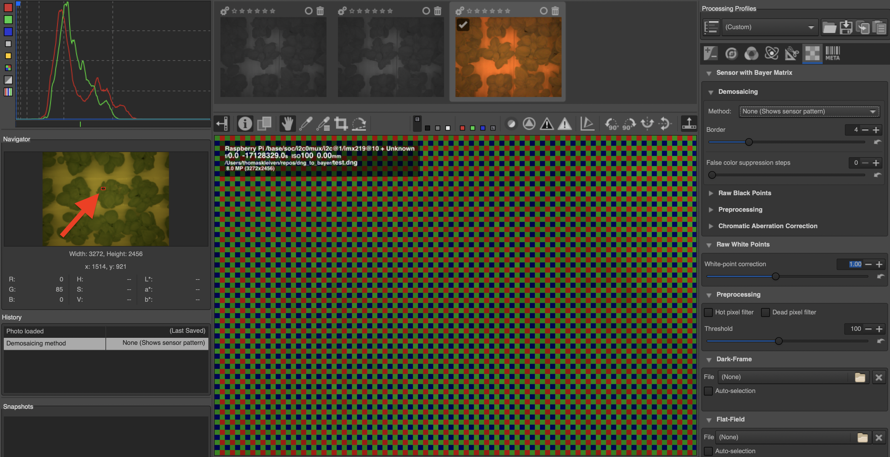

## Goal: Convert .dng file into its into its red, green, and blue components.

Example from [piCamera](https://picamera.readthedocs.io/en/release-1.13/recipes2.html#raw-bayer-data-captures) (in the code exmaple).
